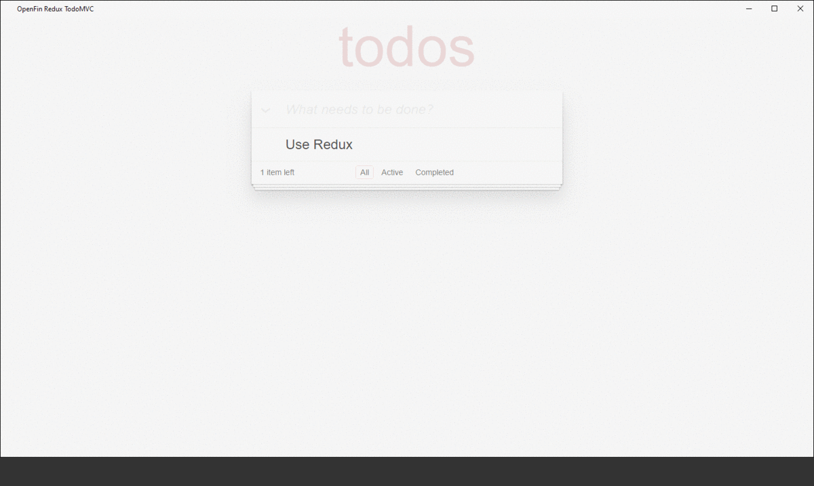
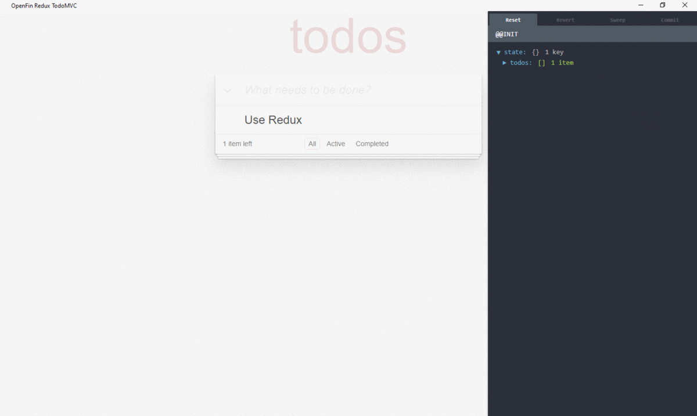
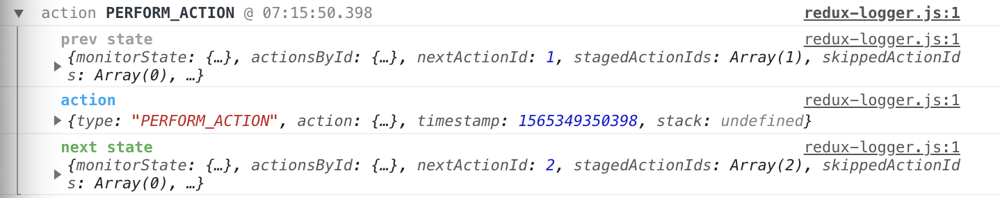

# OpenFin: Redux-Devtools 
### Overview  
This repository demonstrates how to add a Redux devtools for use in an OpenFin development environment. The project consists of an `OpenFin` application running `React | Redux` application that leverages `redux-devtools monitors` which wrap the `redux-devtools ui/monitors` in `React Components` that are `rendered` in the running `OpenFin React App`

### Features
- `hadouken-js-adapter`: used in this case to launch our OpenFin Application programmatically, learn more about the `js-adapter` [here](https://github.com/HadoukenIO/js-adapter)
- `ctrl+h`: hide and show devtools,
> 
- `ctrl+m`: change monitor view,
> 
- `redux-logger`: logs each dispatched `action` in chrome devtools
> 
- `webpack`: hot module reloading (hmr), dev-server

# Installation | Setup
- `git clone https://github.com/adam-saland/of-react-devtools.git`
-  `cd | chdir of-react-devtools`
-  `npm i | install`
-  `npm run start`

### Support
Please enter an issue in the repo for any questions or problems. Alternatively, please contact us at support@openfin.co 
